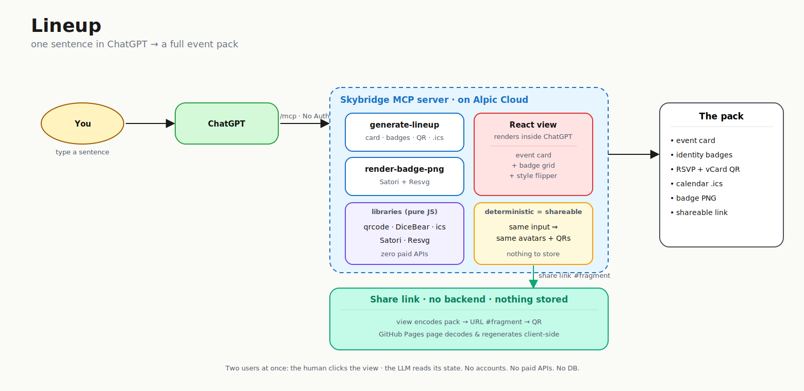

# Lineup

**Turn one sentence into a full event pack — inside ChatGPT.**

Lineup is a ChatGPT App (built on [Alpic Skybridge](https://docs.skybridge.tech)) that takes a freeform event description and generates a Luma-style **event card**, an **identity badge** for every attendee (generated avatar + role + scannable vCard QR), an **RSVP QR**, and a calendar **`.ics`** — in about ten seconds, in the conversation you're already in.

> *"Announce Friday's panel — speakers Lea, Marco and Priya — accent red, notionists style."*


Built for Berlin Hack Night (May 2026) with the Skybridge framework. Coded mainly with **Claude Code**, with **OpenAI Codex** in support.

---

## Why

Keep Luma for the real event page. But the moment you need to **announce it** — an email, a Slack post, a story, a "who's speaking" card — you're back to juggling Canva + a QR generator + a calendar file. Lineup is the **10-second asset generator** that lives in the chat: one sentence in, shareable assets out.

It **complements** Luma / Mailchimp / your CMS rather than replacing them.

## What it does

- **Event card** — title, date, venue, accent gradient, "Add to calendar", RSVP QR
- **Identity badges** — one per attendee: deterministic [DiceBear](https://dicebear.com) avatar in a halo, first name, role pill, vCard QR (scan → save contact), gradient accent border
- **Pick the avatar style from the prompt** — four styles ship; tell the LLM the vibe and it picks (see below)
- **PNG badge export** — download any badge as a real 480×640 "trading card" PNG, composed server-side with [Satori](https://github.com/vercel/satori) + [Resvg](https://github.com/yisibl/resvg-js)
- **Shareable event page** — a scannable link that opens the whole pack as a public web page (see below)

### Avatar styles — pick from the prompt, or flip them live

The whole crew renders in one consistent style. Two ways to set it:

1. **From the sentence** — the LLM picks the style from your prompt and passes it as an argument.
2. **Live in the view** — a row of four Style chips above the badges. Click → every avatar flips in place with a soft fade. The PNG download and the share link follow whatever you've picked.

| Style | Vibe | Try saying… |
|---|---|---|
| **`notionists`** *(default)* | Notion-style sketch — friendly meetups | *"…default style"* (or omit) |
| **`lorelei`** | Monochrome line art — calm, professional | *"…in lorelei line-art style"* |
| **`bottts`** | Colorful robots — playful trading cards | *"…make it a hackathon robot roster"* |
| **`shapes`** | Abstract geometric — anonymous-looking | *"…anonymous voting cards"* |

## One primitive, many use cases

`people + a moment + a scannable code` reshapes into:

| Use case | What it gives you |
|---|---|
| 📣 Announce an event | Card + QR + `.ics` to paste into an email or post |
| 🎤 Share who's speaking | A badge per speaker — avatar, role, contact QR |
| 🗳️ Voting / polls | A unique card + ballot QR per voter |
| 🪪 Conference ID / access | Printable badge, role, check-in QR |
| 🤝 Networking | Badge QR drops your contact into a phone |
| 🏆 Team rosters / crews | A collectible "trading card" per member |

## The shareable page is zero-knowledge by design

The "Share this page" QR/link encodes the **entire compact payload in the URL `#fragment`**. A static page ([`docs/index.html`](docs/index.html) on GitHub Pages) decodes it and regenerates the event card + badges **client-side** (avatars and QRs are deterministic). 

Nothing is stored in any database. Browsers never send URL fragments to servers, so neither GitHub nor the author can read a shared link — **only the people you send it to can.**

🔗 **Live share page:** https://kaiser-data.github.io/lineup/ (open with a Lineup `#…` fragment)

## Live

- **App (MCP endpoint):** `https://lineup-bf157e35.alpic.live/mcp`
- **Playground:** https://lineup-bf157e35.alpic.live/try
- **Share page:** https://kaiser-data.github.io/lineup/

### Add to ChatGPT
1. ChatGPT → Settings → Connectors → **Create**
2. Server URL: `https://lineup-bf157e35.alpic.live/mcp` · Authentication: **No Auth**
3. In a chat: `@lineup Generate a Lineup for Berlin Hack Night at Mindspace, 18:00, accent red, with Marty (Host), Lea (Judge), and Tomás (Hacker).`

## Architecture



Everything is deterministic and pure-JS where it matters (avatars, QRs, calendar), so the same input always produces the same pack — which is exactly why the shareable page can regenerate it from the link alone.

> The Excalidraw source is at [`architecture.excalidraw`](architecture.excalidraw) — open it at [excalidraw.com](https://excalidraw.com) to edit or export a hand-drawn version.

## Tech

[Skybridge](https://docs.skybridge.tech) · React · TypeScript · [qrcode](https://github.com/soldair/node-qrcode) / qrcode.react · [@dicebear](https://dicebear.com) · [ics](https://github.com/adamgibbons/ics) · [satori](https://github.com/vercel/satori) · [@resvg/resvg-js](https://github.com/yisibl/resvg-js)

## Develop

```bash
npm install
npm run dev          # MCP server + DevTools at http://localhost:3000
npm run dev -- --tunnel   # expose to ChatGPT/Claude for testing
```

Tools live in [`src/server.ts`](src/server.ts); the view is [`src/views/generate-lineup.tsx`](src/views/generate-lineup.tsx); generators are in [`src/lib/`](src/lib).

Helper scripts in [`scripts/`](scripts): `status.sh`, `test.sh <payload>`, `save-artifacts.sh`, `tunnel.sh`, `stop.sh`. Test payloads (incl. voting / conference / announcement use cases) in [`test-payloads.json`](test-payloads.json).

## Deploy & self-host

**Yes — Lineup is fully self-hostable, and it generates every graphic itself.**
There is no external image service and no API key: avatars ([DiceBear](https://dicebear.com)),
QR codes ([qrcode](https://github.com/soldair/node-qrcode)), the calendar `.ics`
([ics](https://github.com/adamgibbons/ics)) and the 480×640 PNG badges
([Satori](https://github.com/vercel/satori) + [Resvg](https://github.com/yisibl/resvg-js))
are all rendered in pure JavaScript/WASM inside your own deployment. Host it
anywhere that runs Node or an edge runtime and you own the whole pipeline.

**The MCP app** (the server + ChatGPT view):

```bash
npm run deploy            # → Alpic Cloud (free tier)
# or self-host the same build:
npm run build && npm start            # Node, any host (Fly.io, Railway, Render, a VM)
docker build -t lineup . && docker run -p 3000:3000 lineup   # Dockerfile ships in repo
```

Because the generators are pure-JS / edge-friendly (no `sharp`, no native
`canvas`), **Cloudflare Workers** is a viable target too.

**The share page** (`docs/index.html`) is a single static file with no backend —
host it on GitHub Pages (the default), Netlify, Cloudflare Pages, or any static
host. It regenerates the whole pack client-side from the link `#fragment`, so
self-hosting it stores nothing and needs no server.

## License & attribution

Lineup itself is **MIT** — see [`LICENSE`](LICENSE).

It is built on third-party frameworks and assets, each under its own license.
The **generated graphic** in particular carries attribution requirements:

- **Avatar designs** — [DiceBear](https://dicebear.com) (code MIT). Styles:
  `lorelei` (Lisa Wischofsky, CC0 1.0), `notionists` (Zoish, CC0 1.0),
  `bottts` (Pablo Stanley, free for personal & commercial use),
  `shapes` (DiceBear, CC0 1.0).
- **Inter** font — The Inter Project Authors, [SIL OFL 1.1](https://openfontlicense.org/).
- **Satori** & **Resvg** — MPL-2.0 (used unmodified).

The full component list and licenses are in
[`THIRD-PARTY-NOTICES.md`](THIRD-PARTY-NOTICES.md).
